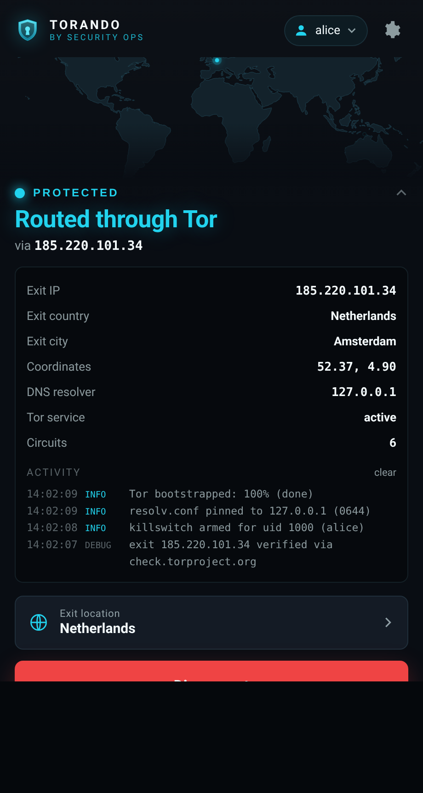
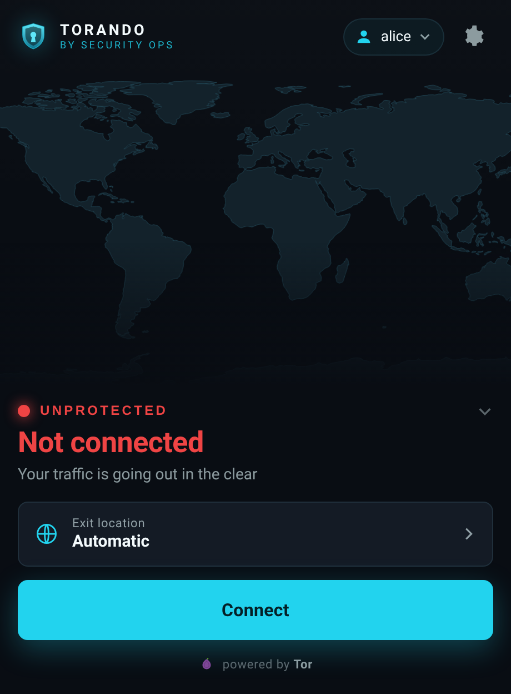
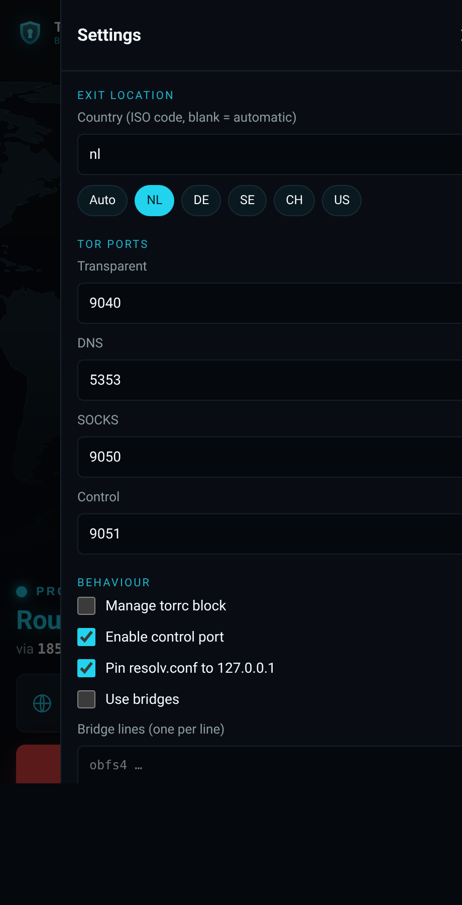

# Torando Control

[](LICENSE)
[](pyproject.toml)
[](pyproject.toml)
[](#platform-support)

Routes a user's traffic through Tor with a killswitch, so nothing leaks if Tor
goes down. A desktop app on top of a small root daemon. On Linux it is a true
per-user transparent proxy (iptables redirect to Tor's TransPort/DNSPort); on
macOS, the BSDs and Windows it points the system SOCKS proxy at Tor and blocks
everything that tries to bypass it. Either way the guarantee is the same:
**fail closed** — traffic that can't go through Tor is dropped, never sent in
the clear. Live status, exit checks, transactional rule changes, and DNS that
always restores itself.

<p align="center">
  
  &nbsp;
  
  &nbsp;
  
</p>

This is not Tor Browser. It routes packets; it does not hide application
fingerprints. Read [THREAT_MODEL.md](THREAT_MODEL.md) before you rely on it.

Docs: [Usage](docs/USAGE.md) · [Threat model](THREAT_MODEL.md) ·
[Changelog](CHANGELOG.md) · [Security policy](SECURITY.md)

## Platform support

The killswitch is fail-closed on every platform; *how* traffic reaches Tor is
what differs, because the OS primitives do.

| Platform | How traffic reaches Tor | Killswitch | DNS pin | Status |
|---|---|---|---|---|
| **Linux** | Per-UID **transparent** redirect (iptables → TransPort/DNSPort) | iptables + **ip6tables** (v4 **and** v6) | `resolv.conf` + `chattr +i` | Stable |
| **macOS** | System **SOCKS** proxy (`networksetup`) | per-UID `pf` `block out user` | `networksetup -setdnsservers` | Beta |
| **FreeBSD** | SOCKS (`torsocks`/per-app) | per-UID `pf` `block out user` | `resolv.conf` + `chflags schg` | Beta |
| **OpenBSD** | SOCKS (`torsocks`/per-app) | per-UID `pf` `block out user` | `resolv.conf` + `chflags schg` | Beta |
| **Windows** | System **SOCKS** proxy (WinINET) | **machine-wide** Windows Firewall default-block-outbound (whitelists `tor.exe` + loopback) | `netsh interface ipv4 set dnsservers` | Beta |

What "transparent" vs "SOCKS" means in practice: on Linux, apps need no
configuration — their packets are redirected into Tor automatically. On the
other platforms, apps that honour the system SOCKS proxy (most browsers, many
tools) go through Tor automatically; apps that ignore it are **blocked** by the
killswitch rather than leaked. Windows is machine-wide (there is no driverless
per-process redirect), so it has no "target user" — the whole machine is
routed. See [docs/USAGE.md](docs/USAGE.md#platform-notes) for the per-OS detail.

New in 1.3.x: the **Windows build is all-in-one** — the `-windows.zip` ships its
own embedded Python and Tor, so there is nothing to install first. **1.3.4** fixes the real reason installs failed: the installer script had an em-dash/accent that Windows PowerShell 5.1 mis-decoded, breaking the script's parse; the `.ps1` files are now pure ASCII (build-guarded). **1.3.3** stopped the flurry of console windows that flashed on Connect and made logging reliable. 1.2.0 added the Linux **IPv6 killswitch** and the native macOS/BSD/Windows backends.

## How it works

There are two pieces. `torando-guid` is the root daemon: it programs netfilter,
edits `torrc` and `resolv.conf`, talks to Tor's control port, and serves a UI on
`127.0.0.1:8088`. `torando-gui` is the front end: a GTK4/WebKitGTK desktop
window (it falls back to your browser if that stack isn't installed). The front
end has no privileges and only talks to the daemon over loopback.

When you connect on **Linux**, the daemon installs a per-UID ruleset. Loopback
is exempt, so the UI keeps reaching its own daemon and local services keep
working:

1. `nat/OUTPUT` — UID to `127.0.0.0/8` → `RETURN` (never touch loopback)
2. `nat/OUTPUT` — UID, TCP → `REDIRECT` to Tor's `TransPort`
3. `nat/OUTPUT` — UID, UDP/53 → `REDIRECT` to Tor's `DNSPort`
4. `filter/OUTPUT` — UID, out on `lo` → `ACCEPT`
5. `filter/OUTPUT` — UID, TCP to `TransPort` → `ACCEPT`
6. `filter/OUTPUT` — UID, UDP to `DNSPort` → `ACCEPT`
7. `filter/OUTPUT` — UID, everything else → `DROP` (the killswitch)

Since 1.2.0 it also installs an **IPv6 killswitch** with `ip6tables` — allow the
UID's loopback, drop everything else — whenever the kernel can carry IPv6.
IPv6 is *blocked* rather than torified (Tor's v4 DNSPort already resolves AAAA
records), which closes the leak that an unfiltered v6 path used to open. If the
kernel has IPv6 but `ip6tables` is missing, connect **refuses** rather than arm a
killswitch that leaks — set `ipv6_killswitch=false` to override.

On **macOS/BSD** the equivalent is a `pf` anchor scoped to the user
(`block out ... user <uid>`, loopback and Tor's own account exempt), hooked into
`pf.conf` via a validated marker block; the daemon sets the system SOCKS proxy
on macOS. On **Windows** it flips the Windows Firewall to block outbound (per
profile, restoring the captured policy on disconnect), whitelists `tor.exe` and
loopback, and points the WinINET system proxy at Tor.

It also writes a marker-delimited block into the Tor `torrc` and pins DNS to
`127.0.0.1` (via `resolv.conf`, `networksetup` or `netsh` depending on the OS),
keeping a backup of the originals.

The target user is resolved to a numeric UID against the passwd database, and
every firewall call is run as an argv with no shell, so a crafted username
can't inject commands. The UI is loopback-only and gated by a per-session token,
a Host-header allowlist, a same-origin check on POSTs, and a strict CSP. No CORS
headers are sent.

## Requirements

- Python 3.11+ (standard library only), and a running `tor` — **except on
  Windows, where the release bundles both** (see below).
- Administrator/root for the daemon (it edits the firewall, DNS and `torrc`).
- Per platform:
  - **Linux** — `iptables` **and** `ip6tables` (legacy or nft-backed), `tor`.
  - **macOS** — `pf` (built in), a `python3` (Xcode Command Line Tools or
    Homebrew), and Homebrew `tor` (`brew install tor`).
  - **FreeBSD/OpenBSD** — `pf` (built in), `python3` and the `tor` package.
  - **Windows 10/11** — **nothing to pre-install.** The `-windows.zip` is an
    all-in-one: it ships its own embedded Python and Tor.
- For the native window (Linux): GTK4, WebKitGTK and PyGObject. Without them the
  app opens in your browser instead — which is also the default on macOS,
  the BSDs and Windows.

## Install

Grab the release assets from the [releases page](https://github.com/cristiancmoises/torando-gui/releases).

### Debian / Ubuntu
```sh
sudo apt install ./torando-gui_1.3.4_all.deb
sudo systemctl enable --now torando-gui.service
torando-gui
```

### Fedora / RHEL
```sh
sudo dnf install ./torando-gui-1.3.4-1.noarch.rpm
sudo systemctl enable --now torando-gui.service
torando-gui
```

### Arch
```sh
makepkg -si          # from packaging/, uses PKGBUILD
sudo systemctl enable --now torando-gui.service
torando-gui
```

### GNU Guix
```sh
guix package -f packaging/guix.scm
```
The Guix build is self-contained: the launchers are rewritten to call the store
`python3` and find `iptables`, `chattr` (`e2fsprogs`) and `tor` in the store, so
nothing extra is needed on `PATH`. It is also in the **securityops** channel:
```sh
guix install torando-gui
# or from a local checkout, without pulling:
guix install -L /path/to/securityops-channel torando-gui
```

On Guix System, daemons run under the GNU Shepherd, not systemd, so the bundled
`torando-gui.service` unit does nothing there. The securityops channel ships a
service type instead:
```scheme
(use-modules (securityops services torando))

(operating-system
  (services
   (cons* (service torando-gui-service-type)
          (service tor-service-type)
          %desktop-services)))
```
Run `guix system reconfigure`, then `herd start torando-gui`. The service
auto-seeds `/etc/torando-gui/config.json` with `manage_torrc` off and
`dns_port` 5353, because on Guix `tor-service-type` owns the read-only
`/etc/tor/torrc` and listens on DNSPort 5353. See [docs/USAGE.md](docs/USAGE.md)
for the per-platform notes.

### AppImage
```sh
chmod +x Torando_Control-x86_64.AppImage
./Torando_Control-x86_64.AppImage
```
Uses `pkexec` to start the root daemon and needs a system `python3` 3.11+. It
doesn't install a systemd unit; the daemon runs for the session.

### macOS
Homebrew (a tap formula ships in `packaging/macos/torando-gui.rb`):
```sh
brew install tor
brew tap cristiancmoises/tap && brew install torando-gui   # once the tap is published
sudo torando-guid          # or load the LaunchDaemon (see below)
torando-gui
```
Or from the `torando-gui-1.3.4-macos.zip` bundle:
```sh
unzip torando-gui-1.3.4-macos.zip && cd torando-gui-1.3.4
sudo ./install.sh          # installs the .app, CLI, and LaunchDaemon
```
The app is unsigned, so the first launch needs Right-click → Open (or
`xattr -dr com.apple.quarantine "/Applications/Torando Control.app"`). macOS
routes via the system SOCKS proxy plus a `pf` killswitch — see the platform
notes in [docs/USAGE.md](docs/USAGE.md#platform-notes).

### FreeBSD / OpenBSD
```sh
# FreeBSD
pkg install tor
tar xzf torando-gui-1.3.4-freebsd.tar.gz && cd torando-gui-1.3.4
sudo ./install.sh && sudo service torando-gui start
# OpenBSD
pkg_add tor
tar xzf torando-gui-1.3.4-openbsd.tar.gz && cd torando-gui-1.3.4
doas ./install.sh && doas rcctl enable torando_gui && doas rcctl start torando_gui
```

### Windows (all-in-one — no prerequisites)
The `-windows.zip` bundles its own embedded Python **and** Tor, so you don't
install anything first. From an **elevated** PowerShell, **run it from the
account you'll use the desktop with**:
```powershell
Expand-Archive torando-gui-1.3.4-windows.zip .; cd torando-gui-1.3.4
powershell -ExecutionPolicy Bypass -File install.ps1
.\torando-gui.cmd
```
`install.ps1` copies the bundle to `Program Files`, writes a `torrc`, and
registers two Scheduled Tasks: the bundled **Tor** as SYSTEM at boot, and the
**daemon as your elevated account at logon** (so the per-user WinINET proxy is set
in *your* registry hive — a SYSTEM daemon would set the wrong one). The killswitch
is machine-wide (there is no per-user redirect on Windows). If the app doesn't
come up, read `%ProgramData%\torando-gui\logs\daemon.log`. `uninstall.ps1` stops
both tasks and restores your firewall/proxy/DNS. (Tor ships frequent security
updates; to refresh the bundled copy, install a newer release or replace
`tor\tor.exe` — see `BUNDLED.txt`.)

## Usage

1. Start the service (Linux: `systemctl start torando-gui.service`, or run
   `torando-gui`, which starts it over polkit on a desktop session; other
   platforms: see [Install](#install)).
2. Pick the user whose traffic should go through Tor. (On Windows the killswitch
   is machine-wide, so there is nothing to pick.)
3. Press Connect. The status tracks Tor's bootstrap; once routed it shows the
   exit IP, country and city, and confirms DNS is pinned.
4. New identity requests a fresh circuit.
5. Press Disconnect to remove the rules and restore your real DNS.

The gear opens settings: Tor ports, exit country, control port, DNS pinning, the
IPv6 killswitch, and bridge lines.

Run the daemon directly for debugging:
```sh
sudo torando-guid --host 127.0.0.1 --port 8088
torando-guid --mock --open      # UI preview, no privileges, no Tor
```
If DNS ever gets stuck pinned to `127.0.0.1`, `sudo torando-guid --restore-dns`
clears the lock and restores your resolver. See
[docs/USAGE.md](docs/USAGE.md#recovery).

## Build from source

```sh
make test            # ruff + pytest
make deb             # dist/torando-gui_1.3.4_all.deb        (needs dpkg-deb)
make rpm             # dist/torando-gui-1.3.4-1.noarch.rpm   (needs rpmbuild)
make appimage        # dist/Torando_Control-x86_64.AppImage  (needs appimagetool)
make tarball         # dist/torando-gui-1.3.4.tar.zst        (needs zstd)
make windows         # dist/torando-gui-1.3.4-windows.zip    (needs zip)
make macos           # dist/torando-gui-1.3.4-macos.zip      (needs zip; png2icns for the icon)
make freebsd openbsd # dist/torando-gui-1.3.4-<os>.tar.gz
make all             # every format whose tooling is present
```

## Layout

- `backend/torando_gui/` — daemon, engine (iptables/ip6tables), `pf` and Windows
  firewall backends, per-platform DNS pinning, Tor control client, exit check,
  torrc/resolv management, server, launcher, desktop window.
- `backend/torando_gui/webroot/` — the UI (no build step, no remote assets).
- `tests/` — engine (v4 + v6), pf/Windows/DNS backends, platform + paths, SOCKS
  framing, exit-check, config, torrc/resolv, server.
- `packaging/` — systemd unit, polkit policy, desktop entry, icon, per-format
  build scripts, `guix.scm`, the Guix Shepherd service, and the
  `windows/`, `macos/`, `freebsd/` and `openbsd/` release bundles.

## Repositories

Official: **Forgejo** (`git.securityops.co/cristiancmoises/torando-gui`).
Mirrors: [GitHub](https://github.com/cristiancmoises/torando-gui) and
[Codeberg](https://codeberg.org/berkeley/torando-gui). Contribute on whichever
you like; see [CONTRIBUTING.md](CONTRIBUTING.md). Report security issues
privately per [SECURITY.md](SECURITY.md).

## License

AGPL-3.0-only, see [LICENSE](LICENSE). The upstream `torando` scripts are
GPL-3.0; this is an independent reimplementation with a GUI.
